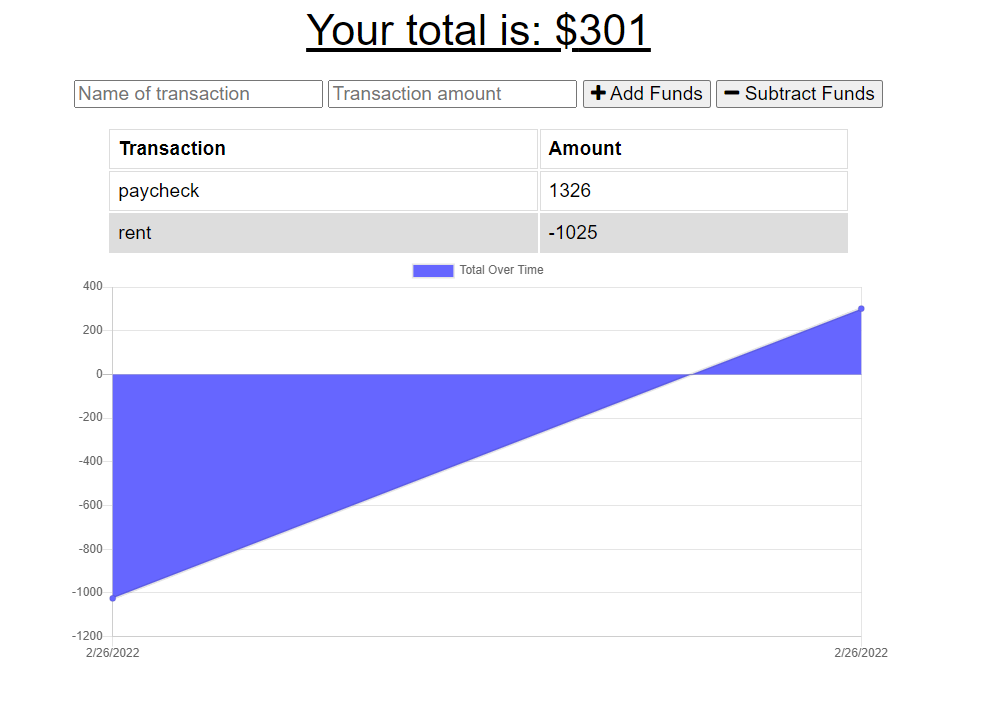

# Budgeters Friend

## Description

This app allows a user to keep track of their money. Users can keep track of incoming and outgoing transactions through this handy app. Even when the internet is spotty, the program saves any transaction data that was made and uploads it once the app is back online.

## Installation

Budgeters Friend can be installed by downloading the files from github and running 'npm install' to install the necessary packages to use it. However, since the app is deployed to heroku, it does not need to be installed on a user's device in order to use it. 

## Usage

The deployed application can be found by following [this link](https://nameless-thicket-77989.herokuapp.com/). To track any transactions in the app, a user can enter a name for a transaction, such as "money from mom" and then enter the amount of money and click the 'add funds' button if the transaction is for incoming money, or the 'subtract funds' button if the transaction is for outgoing money. The following screenshot shows an example of the app with 2 transactions posted.

## Questions

Any questions can be directed to my email: <kerbunker@gmail.com> or through github [kerbunker](https://github.com/kerbunker/budgeters-friend).

